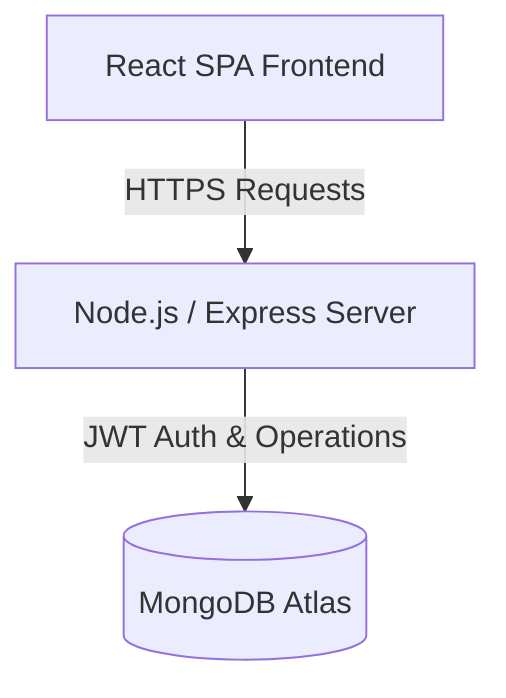

# AgileForge

AgileForge is a lightweight, high-performance Agile project management platform built on the MERN stack. Designed specifically for small-to-medium development teams, it simplifies workspace organization, sprint planning, backlog grooming, team analytics, and issue tracking.

---

## Key Features

- **Agile Workflows & Kanban Board**: Fully interactive drag-and-drop board for status tracking.
- **Sprint Management & Backlog**: Group tasks by priority, assign story points, create and execute sprints.
- **Performance Analytics Dashboard**: Live metrics containing issue type breakdown, completion rate, status distribution, and sprint progress tracking.
- **Team Insights & Gamified Leaderboard**: View task completion rates, total story points completed per member, and active task distribution.
- **Role-Based Access Control (RBAC)**: Fine-grained permissions for Admin, Project Lead, Developer, and Viewer roles.
- **Activity Log**: Event log showing real-time updates of project changes.

---

## Tech Stack & Architecture

AgileForge uses a modern decoupled architecture:



- **Frontend**: React (Vite), React Query, Lucide Icons, Recharts, React Router DOM.
- **Backend**: Node.js, Express, Mongoose (MongoDB ODM).
- **Authentication**: Stateless JSON Web Tokens (JWT) stored in HTTP-only state.
- **Styling**: Pure CSS with CSS custom variables supporting a clean light-mode UI.

---

## Directory Structure

```text
AgileForge/
├── client/                 # Frontend SPA (React + Vite)
│   ├── src/
│   │   ├── components/     # Reusable UI components & layouts
│   │   ├── pages/          # Auth, Dashboard, Board, Backlog, Team, Sprints
│   │   ├── services/       # Axios API client setup
│   │   ├── store/          # Zustand state management
│   │   ├── index.css       # Core design system & variables
│   │   └── App.jsx         # Routing configuration
│   └── package.json
├── server/                 # Backend REST API (Node + Express)
│   ├── config/             # DB connection logic
│   ├── models/             # Mongoose schemas (User, Project, Issue, Sprint, Activity)
│   ├── routes/             # API routes
│   ├── seed/               # Database seeder scripts
│   └── server.js           # Express main application entrypoint
└── package.json
```

---

## Getting Started & Local Setup

### Prerequisites

Ensure you have the following installed on your machine:
- **Node.js** (v16.x or newer)
- **npm** (v8.x or newer)
- A running **MongoDB instance** (local or MongoDB Atlas cluster)

---

### Step 1: Clone the Repository

```bash
git clone https://github.com/Aditi187/agileforge.git
cd agileforge
```

---

### Step 2: Backend Setup

1. Navigate to the `server` directory:
   ```bash
   cd server
   ```

2. Copy the sample environment file and configure the keys:
   ```bash
   cp .env.example .env
   ```

3. Open `.env` and fill in your connection variables:
   ```env
   PORT=5000
   MONGO_URI=mongodb+srv://<username>:<password>@cluster.mongodb.net/agileforge
   JWT_SECRET=your_jwt_secret_key_here
   ```

4. Install the dependencies:
   ```bash
   npm install
   ```

5. (Optional) Seed the database with demo accounts and dummy projects:
   ```bash
   npm run seed
   ```

6. Start the server in development mode:
   ```bash
   npm run dev
   ```
   The backend service will start running at `http://localhost:5000`.

---

### Step 3: Frontend Setup

1. Open a new terminal tab and navigate to the `client` directory:
   ```bash
   cd client
   ```

2. Configure the API endpoint in the env config or axios client (`src/services/api.js`) to point to your local backend (`http://localhost:5000/api`).

3. Install the dependencies:
   ```bash
   npm install
   ```

4. Start the development server:
   ```bash
   npm run dev
   ```
   The frontend application will start running at `http://localhost:5173`.

---

## Demo Accounts

For testing the RBAC policies, you can use the pre-configured demo users:

| Role | Email | Password | Permissions |
| :--- | :--- | :--- | :--- |
| **Admin** | `aditi.sharma@gmail.com` | `Admin@123` | Full workspace admin access (Create projects/sprints, update roles). |
| **Project Lead** | `rahul.verma@gmail.com` | `Lead@123` | Manage sprints, create issues, and assign team members. |
| **Developer** | `priya.patel@gmail.com` | `Dev@123` | Move issues on board, add comments, view dashboard analytics. |

---

## Deployment Configuration

This project is configured for serverless hosting on Vercel:
- **Client Configuration**: Set via `client/vercel.json` to handle React client-side routing rewrites.
- **Server Configuration**: Configured with Vercel API routing rules.
